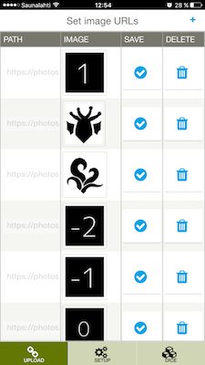
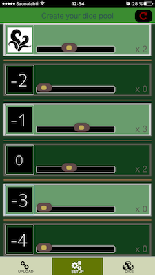
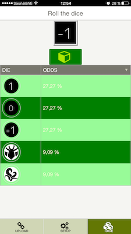

ImageRulette
==============

[You can try here](https://mighty-ravine-21171.herokuapp.com)

Simple Vaadin application that only requires a Servlet 3.0 container to run. It has Jetty server embedded into war file

Workflow
========

Basic Vaadin web app with Touchkit included that allows to set up to 30 static url images.
With all uploaded URLs, user can setup how many images to use and then play with a dice simulator
All urls are stored in browser cache.

Views
-------------------------

Upload images

Setup images

Dice simulator

Running project locally
-------------------------

From Vaadin template doc...
To compile the entire project, run "mvn install".
To run the application, run "mvn jetty:run" and open http://localhost:8080/ .
